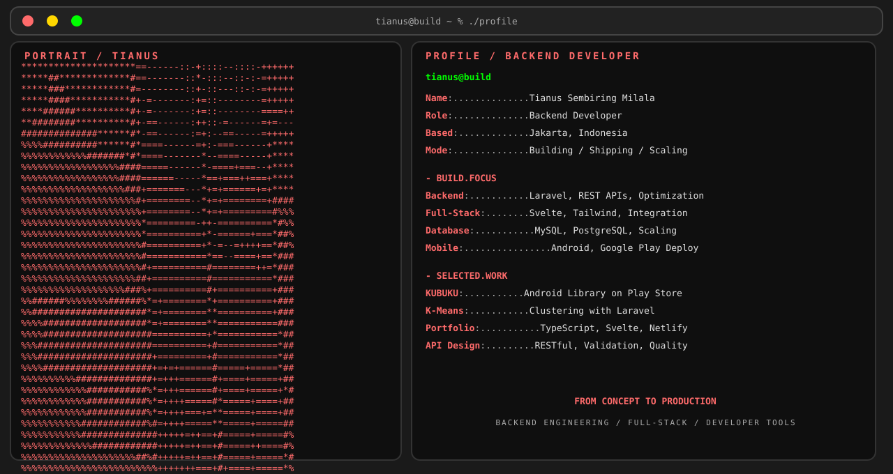

  <picture>
    <source media="(max-width: 760px) and (prefers-color-scheme: dark)" srcset="./assets/hero/builder-profile-v2-mobile-dark.svg">
    <source media="(max-width: 760px)" srcset="./assets/hero/builder-profile-v2-mobile-light.svg">
    <source media="(prefers-color-scheme: dark)" srcset="./assets/hero/builder-profile-v2-dark.svg">
    <source media="(prefers-color-scheme: light)" srcset="./assets/hero/builder-profile-v2-light.svg">
    
  </picture>

  <a href="https://tians4dev.netlify.app"><strong>View Portfolio</strong></a>

## Hey, I'm Tianus

I'm a **backend developer** based in Jakarta, Indonesia. I work across **Laravel applications, REST APIs, and full-stack web development**, building scalable products and modern web solutions.

I enjoy taking projects from concept to release: defining structure, building backend systems, integrating frontends, and ensuring reliable deployment.

## What I Build

- **Backend systems:** Laravel applications, REST APIs, database architecture, and server optimization with PHP/Slim 4.
- **Full-stack development:** Frontend integration with backend logic using Svelte, Tailwind CSS, and modern JavaScript.
- **Mobile solutions:** Android apps with backend integration deployed to Google Play Store.
- **Database design:** MySQL, PostgreSQL optimization and schema architecture for scalable applications.

## Selected Work

| Project | What I built | My role · Current state |
| --- | --- | --- |
| [**Admin Perpustakaan KUBUKU**](https://play.google.com/store/apps/details?id=id.kubuku.newperpus) · [Live](https://play.google.com/store/apps/details?id=id.kubuku.newperpus) | Android library management system with backend integration. Real-world app on Google Play Store. | Full-Stack Developer Live · Google Play |
| [**Website K-Means Laravel**](https://github.com/JustD09/Website-K-Means-Laravel) | Infrastructure analysis system implementing K-Means clustering algorithm with Laravel backend. | Backend Developer Active |
| [**Portfolio Web**](https://github.com/JustD09/portfolio-web-ts) · [Live](https://tians4dev.netlify.app/) | Personal portfolio built with TypeScript, Svelte, and Tailwind CSS showcasing projects and skills. | Full-Stack Developer Live · Active |

## Selected Highlights

- **KUBUKU app:** live on Google Play Store with 1000+ downloads and active maintenance.
- **Laravel projects:** 4+ production-ready applications with optimized database schemas.
- **Full-stack mastery:** combining PHP backend with modern frontend frameworks.
- **API design:** RESTful API architecture with proper validation and error handling.

## What I'm Exploring

I'm interested in backend optimization, microservices architecture, and building performant systems that scale.

Learning system design and architecture helps me understand deeper principles. Building projects and deploying them to production is how I validate those ideas in practice.

## Tools I Use

`PHP` · `Laravel` · `Slim 4` · `Svelte` · `Tailwind CSS` · `MySQL` · `PostgreSQL` · `REST API` · `Git` · `GitHub` · `GitLab` · `HeidiSQL` · `OpenCode`

## Contribution Trail

  GitHub activity coming soon

<strong>Recent public activity</strong>

 

<!-- AUTO:ACTIVITY:START -->
- Portfolio website updates and deployment
- K-Means clustering implementation in Laravel
- KUBUKU app maintenance and feature updates
- REST API optimization and testing
- Database schema refinement for scalability
<!-- AUTO:ACTIVITY:END -->

---

  <a href="https://www.linkedin.com/in/tianus-sembiring-milala-a504651a9/">LinkedIn</a> · 
  <a href="https://www.facebook.com/CaptainTSM/">Facebook</a> · 
  <a href="https://www.instagram.com/alonelyguy_3">Instagram</a> · 
  <a href="https://www.tiktok.com/@t9702jkt">TikTok</a>

---

  Building scalable backend systems and full-stack web applications.

