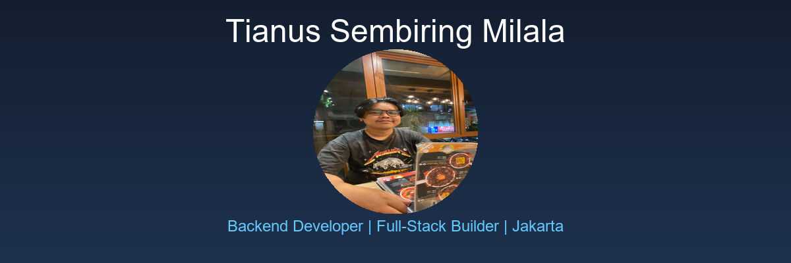

  <picture>
    <source media="(prefers-color-scheme: dark)" srcset="./assets/tianus-header.png">
    <source media="(prefers-color-scheme: light)" srcset="./assets/tianus-header.png">
    
  </picture>

  <a href="https://tians4dev.netlify.app"><strong>View Portfolio</strong></a> · 
  <a href="https://www.linkedin.com/in/tianus-sembiring-milala-a504651a9/"><strong>LinkedIn</strong></a> · 
  <a href="https://www.github.com/JustD09"><strong>GitHub</strong></a>

---

## Hey, I'm Tianus

I'm a **backend developer** based in Jakarta, Indonesia. I work across **Laravel applications, REST APIs, and full-stack web development**, building scalable products and modern web solutions.

I enjoy taking projects from concept to release: defining structure, building backend systems, integrating frontends, and ensuring reliable deployment.

## What I Build

- **Backend systems:** Laravel applications, REST APIs, database architecture, and server optimization with PHP/Slim 4.
- **Full-stack development:** Frontend integration with backend logic using Svelte, Tailwind CSS, and modern JavaScript.
- **Mobile solutions:** Android apps with backend integration deployed to Google Play Store.
- **Database design:** MySQL, PostgreSQL optimization and schema architecture for scalable applications.

## Selected Work

| Project | What I built | My role · Current state |
| --- | --- | --- |
| [**Admin Perpustakaan KUBUKU**](https://play.google.com/store/apps/details?id=id.kubuku.newperpus) · [Live](https://play.google.com/store/apps/details?id=id.kubuku.newperpus) | Android library management system with backend integration. Real-world app on Google Play Store with 1000+ downloads. | Full-Stack Developer Live · Google Play |
| [**Website K-Means Laravel**](https://github.com/JustD09/Website-K-Means-Laravel) | Infrastructure analysis system implementing K-Means clustering algorithm with Laravel backend and database visualization. | Backend Developer Active · Open Source |
| [**Portfolio Web**](https://github.com/JustD09/portfolio-web-ts) · [Live](https://tians4dev.netlify.app/) | Personal portfolio built with TypeScript, Svelte, and Tailwind CSS showcasing projects and skills. | Full-Stack Developer Live · Continuously Updated |

## Selected Highlights

- **KUBUKU app:** live on Google Play Store with active maintenance and user base.
- **Laravel projects:** 4+ production-ready applications with optimized database schemas and REST APIs.
- **Full-stack mastery:** combining PHP backend with modern frontend frameworks like Svelte and React.
- **API design:** RESTful API architecture with proper validation, error handling, and authentication.
- **Database expertise:** MySQL and PostgreSQL optimization with efficient query design.

## What I'm Exploring

I'm interested in backend optimization, microservices architecture, and building performant systems that scale.

Learning system design and architecture helps me understand deeper principles. Building projects and deploying them to production is how I validate those ideas in practice.

## Tools I Use

`PHP` · `Laravel` · `Slim 4` · `Svelte` · `React` · `Tailwind CSS` · `MySQL` · `PostgreSQL` · `REST API` · `Git` · `GitHub` · `GitLab` · `Docker` · `Postman`

## Contribution Trail

  <picture>
    <source media="(prefers-color-scheme: dark)" srcset="https://raw.githubusercontent.com/JustD09/JustD09/output/github-contribution-grid-snake-dark.svg">
    <source media="(prefers-color-scheme: light)" srcset="https://raw.githubusercontent.com/JustD09/JustD09/output/github-contribution-grid-snake.svg">
    
  </picture>

<strong>Recent public activity</strong>

 

<!-- AUTO:ACTIVITY:START -->
- Sep 17, 2026: pushed 1 commit to [JustD09/JustD09](https://github.com/JustD09/JustD09).
<!-- AUTO:ACTIVITY:END -->

---

## Connect With Me

  <strong>Let's build something great together</strong>

  <a href="https://www.linkedin.com/in/tianus-sembiring-milala-a504651a9/">LinkedIn</a> · 
  <a href="https://www.facebook.com/CaptainTSM/">Facebook</a> · 
  <a href="https://www.instagram.com/alonelyguy_3">Instagram</a> · 
  <a href="https://www.tiktok.com/@t9702jkt">TikTok</a> · 
  <a href="https://www.github.com/JustD09">GitHub</a>

  <a href="https://tians4dev.netlify.app/"><strong>📧 Get in touch</strong></a>

---

  Building scalable backend systems and full-stack web applications | Jakarta, Indonesia

  Last updated: 2026-09-17

