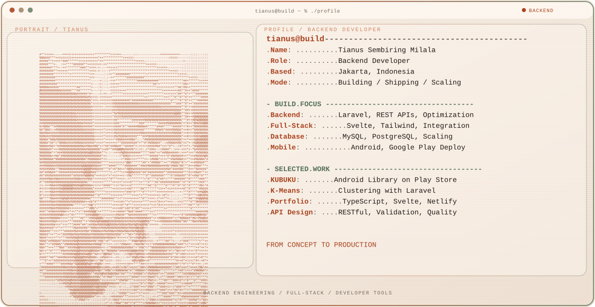

  <picture>
    <source media="(prefers-color-scheme: dark)" srcset="./assets/hero/builder-profile-v2-dark.svg">
    <source media="(prefers-color-scheme: light)" srcset="./assets/hero/builder-profile-v2-light.svg">
    
  </picture>

  <a href="https://tians4dev.netlify.app"><strong>→ View Portfolio</strong></a> · 
  <a href="https://www.linkedin.com/in/tianus-sembiring-milala-a504651a9/"><strong>→ LinkedIn</strong></a> · 
  <a href="https://www.github.com/JustD09"><strong>→ GitHub</strong></a>

---

## Overview

Backend developer from Jakarta building scalable systems, REST APIs, and full-stack web applications. I focus on clean code, performance, and deployment excellence.

Currently exploring microservices architecture, API optimization, and production-grade database design.

---

## Tech Stack

**Backend:** PHP · Laravel · Slim 4 · Node.js

**Frontend:** Svelte · Tailwind CSS · FIlament

**Database:** MySQL · PostgreSQL · Query Optimization

**Tools & DevOps:** Git · GitHub · GitLab · Postman · HeidiSQL

**Mobile:** Flutter · Google Play Store

---

## Featured Projects

### Admin Perpustakaan KUBUKU
**Android library management system deployed on Google Play Store**
- Full-stack development (Flutter + Slim 4 + MySQL)
- Real-world production app with active users
- Backend API integration & database design
- [View on Play Store →](https://play.google.com/store/apps/details?id=id.kubuku.newperpus)

### Website K-Means Laravel
**Infrastructure analysis system with K-Means clustering algorithm**
- Laravel backend with clustering implementation
- Database visualization & optimization
- RESTful API design
- [View Repository →](https://github.com/JustD09/Website-K-Means-Laravel)

### Portfolio Web
**Personal portfolio showcasing projects and skills**
- Built with TypeScript, Svelte, Tailwind CSS
- Modern responsive design
- Live at tians4dev.netlify.app
- [View Live →](https://tians4dev.netlify.app/) · [View Code →](https://github.com/JustD09/portfolio-web-ts)

---

## What I Focus On

- **API Architecture:** Designing clean, scalable REST APIs with proper validation & error handling
- **Database Optimization:** MySQL & PostgreSQL schema design, query optimization, indexing strategies
- **Full-Stack Integration:** Seamless backend-frontend integration with modern frameworks
- **Code Quality:** Clean code principles, testing, documentation, and maintainability

---

## Stats & Activity

  <picture>
    <source media="(prefers-color-scheme: dark)" srcset="https://raw.githubusercontent.com/JustD09/JustD09/output/github-contribution-grid-snake-dark.svg">
    <source media="(prefers-color-scheme: light)" srcset="https://raw.githubusercontent.com/JustD09/JustD09/output/github-contribution-grid-snake.svg">
    
  </picture>

<strong>📊 Recent Activity</strong>

 

<!-- AUTO:ACTIVITY:START -->
- Sep 17, 2026: pushed 1 commit to [JustD09/JustD09](https://github.com/JustD09/JustD09).
<!-- AUTO:ACTIVITY:END -->

---

## Connect

  <strong>Always open to collaborating on backend systems and full-stack projects</strong>

| Platform | Link |
|----------|------|
| **LinkedIn** | [tianus-sembiring-milala](https://www.linkedin.com/in/tianus-sembiring-milala-a504651a9/) |
| **GitHub** | [@JustD09](https://github.com/JustD09) |
| **Portfolio** | [tians4dev.netlify.app](https://tians4dev.netlify.app/) |
| **Email** | [Get in touch via portfolio](https://tians4dev.netlify.app/) |

  <a href="https://tians4dev.netlify.app/"><strong>📧 Contact me</strong></a>

---

  Built with passion | Jakarta, Indonesia 
  Backend Developer | Full-Stack Builder | Always Learning

